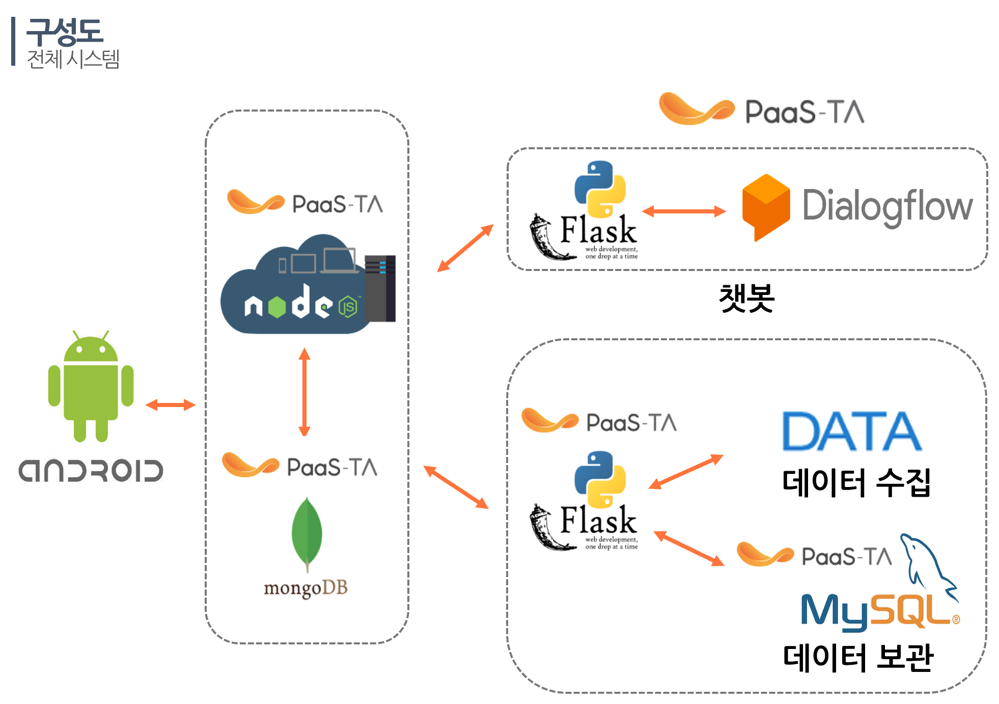

# BOKJIDA
사용자 맞춤 복지 정보 추천 서비스 제공 앱

## USAGE

1. 회원가입시 입력한 정보를 토대로 받을 수 있는 복지 정보 추천
2. 챗봇을 활용한 복지 정보 검색
3. 복지 정보 신청 알람 서비스

## DATA
* <a href="http://bokjiro.go.kr/nwel/bokjiroMain.do">복지로</a>
* <a href="https://www.busan.go.kr/young/index">부산청년</a>
* <a href="http://www.busan.go.kr/welfare/index">부산시청</a>
* <a href="https://www.dongnae.go.kr/health/index.dongnae">보건소</a>
* <a href="http://www.gukbi.com/">국비지원교육</a>

## CONFIGURATION

</img>
___
### FRONTEND
* Android App
___
### BACKEND

#### WEB SERVER

##### CHATBOT
* Dialogflow  
* NodeJS

##### REST API
* Python Flask

#### DATABASE
* AWS MySQL
___
